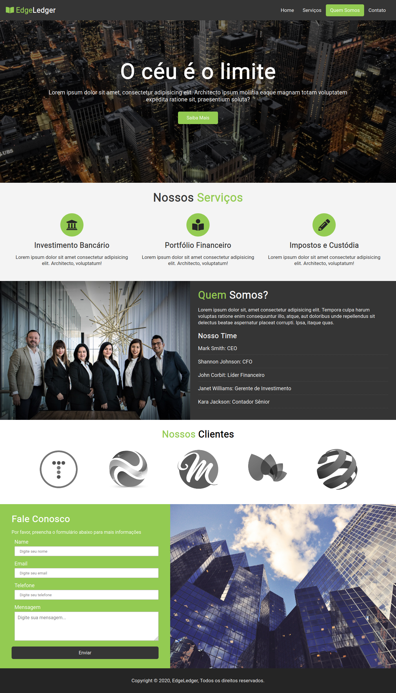

# edgeledger-website

## Project

***EN:*** This is a simple website from a fictional company that I created for study purposes with a focus on using the Flexbox of CSS3 through the Modern HTML & CSS From The Beginning course by Brad Traversy.

***PT-BR:*** Um simples website de uma empresa fictícia que eu criei para propósito de estudo com foco na utilização do Flexbox do CSS3 através do curso Modern HTML & CSS From The Beginning de Brad Traversy.
***

## Technologies

This project was developed with the following technologies:

- HTML
- CSS
- JavaScript
***
 
## Preview

***

## License

This project is under the MIT license.
